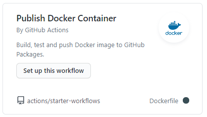

# Set up Continuous Integration to push container images to Github Registry
Developers are working locally with their images to quickly develop the software. However, when it comes to testing, the team notices that there is a lot of differences. Small bugs occur because the latest version was not used, and because everybody is building their own container images, there is not a "golden image" that can be used for tests. You and your team suggest to implement Continuous Integration and to push the latest version of the container to a Container Registry hosted on Github. This container registry can then serve as the repository that contains the latest images that can be used to deploy on the various environments for testing etc.

## Challenge
In this challenge you are going to shorten the feedback loop and ensure that stable images are centrally available. For that you are going to set up a Continuous Integration Build that builds the Docker image and pushes that to the Github Container Registry.

## Validation
* Github Container Registry populated with 3 docker images. [fabrikam-init], [fabrikam-web] and [fabrikam-api]
* Github Action workflow created that builds and pushes the [fabrikam-web] (from the content-web) image to the Github Container Registry
* Github Action workflow created that builds and pushes the [fabrikam-api] (from the content-api) image to the Github Container Registry
* Github Action workflow created that builds and pushes the [fabrikam-init] (from the content-init) image to the Github Container Registry

> Tips
> Create a Github Action based on the [Publish Docker Container] startup workflow
> Create a PAT token in GitHub and add it as a GitHub secret as CR_PAT to access the Github Container registry

## Links
* [Getting started with GitHub Container Registry](https://docs.github.com/en/packages/getting-started-with-github-container-registry)
* [Publishing a package using an action](https://docs.github.com/en/packages/using-github-packages-with-your-projects-ecosystem/using-github-packages-with-github-actions#publishing-a-package-using-an-action)
* [Migrating to GitHub Container Registry for Docker images](https://docs.github.com/en/packages/getting-started-with-github-container-registry/migrating-to-github-container-registry-for-docker-images)
* [Pushing and pulling Docker images](https://docs.github.com/en/packages/managing-container-images-with-github-container-registry/pushing-and-pulling-docker-images)
* [Publish containers to Github Container Registry with Github Actions](https://medium.com/cooking-with-azure/publish-containers-to-github-container-registry-with-github-actions-4e39700ae14c)