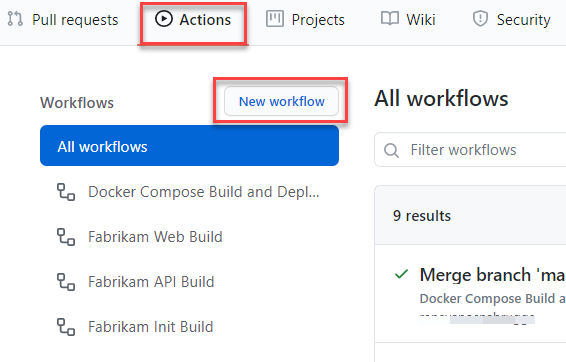
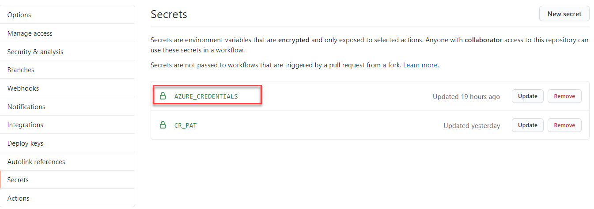

# Step by Step CLOSELOOP-T002

In this task your are going to create a continuous deployment pipeline in GitHub Actions that triggers after the Continuous Integration build has been completed. 

>This task has a Starter solution, that creates a Pull Request containing some files and instructions. 
>
> In order to run the automated Starter Solution, you need to go through the [Setup prerequisites](/Challenges/Prerequisites/Readme.md) first!

1. In your GitHub Codespace, open a PowerShell Terminal and run the starter solution. A Pull Request with a new `deploy-infrastructure.ps1` will be created

      ```
      Workshop-Step Start "CLOSELOOP-T002"
      ```

2. In your GitHub repository, navigate to the Tab Pull Requests and open the Pull Request with CLOSELOOP-T002 in the title

3. In the Pull Request, check the conversation, Commits, Checks and Files Changed Tabs, and got through the instructions and changes.

4. On the Conversation Tab, press the Merge Pull Request Button, to merge the files in to the main branch. Link the Pull Request to your Azure Boards Work item for Module 3 by typing AB#Module1WorkItemID in the title or description of the Pull Request Commit Message. 

      

Now your repository contains the new file.

6. In your GitHub Codespace, update your files to the latest version by pulling them.

      

## Create a new GitHub Action Workflow that builds and pushes with Docker Compose

1. When we start to use docker-compose as our mechanism to build and push containers, we need to give docker compose instructions where to find the Docker files that can be used to build the images. We already have a `docker-compose.yml` file in our repository, but this contains the name of the images, and not the instructions to build the containers. 

Add a `build.docker-compose.yml` file to the root of your repository and add the following contents

```YAML
version: "3.4"
services:
  api:
    build: ./content-api

  web:
    build: ./content-web
```

2. To use docker compose in our build, we are going to add a new GitHub Action workflow. In your GutHub repository, open the [Actions] Tab and create a new GitHub Action.



3. Select the Simple Workflow and call the new YAML file docker-publish.yml


4. Change the `name` property to [Docker Compose Build and Deploy]. And add the following code snippet below the  `- uses: actions/checkout@v2` step

```YAML
  - name: Log into GitHub Container Registry
    run: echo "${{ secrets.CR_PAT }}" | docker login https://ghcr.io -u ${{ github.actor }} --password-stdin
```

This step logs in to your GitHub Container Registry with the CR_PAT secret that you created earlier

5. Add a script step that uses `docker-compose` to build and push the images to the repository

```YAML
  - name: Build and Push image
    run: |  
      docker-compose -f docker-compose.yml -f build.docker-compose.yml build
      docker-compose -f docker-compose.yml -f build.docker-compose.yml push
```
This step uses the docker-compose.yml and build.docker-compose.yml to build the containers with the Docker files and push it to the GitHub Container Registry

6. Now that the containers have been built and pushed, the Azure Web Application needs to be updated. Before you can interact with Azure, you need to have access to the Azure API with the Azure CLI. Using the Azure Login Task, we can login securely in Azure using a GitHub secret.

In your Codespace terminal, execute the following script to login to Azure, set your subscription and create a Service Principal with access to your resourcegroup.

```PowerShell
$studentprefix ="your abbreviation here"
$resourcegroupName = "fabmedical-rg-" + $studentprefix 
$rg = az group show --name $resourcegroupName | ConvertFrom-Json
az ad sp create-for-rbac --name "codetocloud-$studentprefix" --sdk-auth --role contributor --scopes $($rg.id)
```

The output of this command looks like this
```JSON
{
  "clientId": "...",
  "clientSecret": "...",
  "subscriptionId": "...",
  "tenantId": "...",
  "activeDirectoryEndpointUrl": "https://login.microsoftonline.com",
  "resourceManagerEndpointUrl": "https://management.azure.com/",
  "activeDirectoryGraphResourceId": "https://graph.windows.net/",
  "sqlManagementEndpointUrl": "https://management.core.windows.net:8443/",
  "galleryEndpointUrl": "https://gallery.azure.com/",
  "managementEndpointUrl": "https://management.core.windows.net/"
}
```

Copy the complete JSON output to your clipboard.

7. In your repository settings, navigate to [Secrets] and create a new secret called [AZURE_CREDENTIALS]. Paste the copied value from your clipboard to the value of the secret and save it.



8. Back in the GitHub Action workflow, add a new step that uses the [AZURE_CREDENTIALS] secret to login to Azure
      
```
  - name: Login on Azure CLI
    uses: azure/login@v1.1
    with:
      creds: ${{secrets.AZURE_CREDENTIALS}}
```          

9. In your Codespace, open the `deploy-infrastructure.ps1` file from the [infrastructure] folder and make sure it has the following content, 

1. Add a build.docker-compose file
2. Add a GitHub Action workflow that includes 2 steps
..
```
name: Docker Compose Build and Deploy

on:
  push:
    # Publish `main` as Docker `latest` image.
    branches:
      - main

    # Publish `v1.2.3` tags as releases.
    tags:
      - v*

  # Run tests for any PRs.
  pull_request:

jobs:
  push:
    runs-on: ubuntu-latest

    steps:
      - uses: actions/checkout@v2

      - name: Log into GitHub Container Registry
        run: echo "${{ secrets.CR_PAT }}" | docker login https://ghcr.io -u ${{ github.actor }} --password-stdin

      - name: Build and Push image
        run: |
          docker-compose -f docker-compose.yml -f build.docker-compose.yml build
          docker-compose -f docker-compose.yml -f build.docker-compose.yml push
```

3. add a deployment stage
4. use the GH Action https://github.com/marketplace/actions/azure-login
5. create a sp for rbac
```
az ad sp create-for-rbac --name "CodeToCloudWorkshop-$($studentprefix)" --sdk-auth --role contributor --scopes $($rg.id)
```
6. create a secrey calle d  AZURE_CREDENTIALS

```
{
  "clientId": "499aa4bf-c264-4bed-9cc8-d608c47a8c88",
  "clientSecret": "5_3kbmIU_lhzlkRwpRk03zwJsW-5dAiqbd",
  "subscriptionId": "fe243e23-d788-4bf4-a76d-480b957964ac",
  "tenantId": "ed6acf0d-9ed3-4a2a-a1b1-97384cdaa08b",
  "activeDirectoryEndpointUrl": "https://login.microsoftonline.com",
  "resourceManagerEndpointUrl": "https://management.azure.com/",
  "activeDirectoryGraphResourceId": "https://graph.windows.net/",
  "sqlManagementEndpointUrl": "https://management.core.windows.net:8443/",
  "galleryEndpointUrl": "https://gallery.azure.com/",
  "managementEndpointUrl": "https://management.core.windows.net/"
}
```


# Disable your actions

 * Turn off your actions by deleting your docker yml files and committing those changes.

# Connect GitHub to Azure DevOps

 * Create service connection of type Docker Container Registy
 * Create new pipeline in your CodeToCloud-Workshop project
 * Where's your code: pick Github
 * Authorize if needed. 
   * Note: everyone with read permissions on the GitHub endpoint will be able to accerr all your repos. 
   * Alternatively: install the Azure Pipelines App to handle auth: https://github.com/apps/azure-pipelines/installations/new
 * Select CodeToSCloud-Source repo
 * Choose the starter pipeline template

# Configure the pipeline

> You can edit your pipeline in the web UI of Azure DevOps using the steps helper, but you can also edit the `azure-pipelines.yml` in vscode and rely on its intellisense feature to guide you.

 * First lets do everything in a single job, like we have with actions.
 * Add Docker Compose task for build step
 * Add Docker Compose task for publish step
 * Add PS task to run infrastraucture.ps1
 * Add Azure CLI task to run az web app create... Authorize your Azure DevOps Account to access your Azure Subscription to add a service connection.
 * Use `name:` to set the buildnumber which will be added as a tag the image automatically
 * Make sure trigger is set to `trigger: main` and `pr: main`
 * Normal varialbles are created in the YAML files' variables section. Secret variables must be created on the `Variables` tab hidden under the `[Variables]` menu in the upper right corner of the editor. Add a `GHCR_SECRET` variable and mark its `Keep this value secet` option.


# Add approvals

 * In Azure Pipelines choose "Environments"
 * Create a new environment called "production"
 * Configure approvals for production using the `[...]` menu. Alternatively, show now to do with `az pipelines`
 * edit existing pipeline
 * split the pipeline into 2 stages. 
    1. stage: build
    2. stage: production
       1. job: infra
       2. job: deploy
 * Add `environment: production` to jobs.
 * Add dependencies to stages and jobs `dependsOn:`
 * Make sure the deploy stage won't  run on PR builds. Add `condition:`.
 * Add `checkout: self` to each job to have it checkout the git repo. **If this won't work we need to publish the ps and docker-compose files as artifacts in the build stage instead.**
 * Add PS to replace `:latest` with specific version.


# Add Advanced gates

 * Go to environments, select prod, add more gates:
   * Branch Validation. Must come from main. (optionally verify branch protection to enforce pull request workflow).
   * Container Registries. Ensure all our images are pulled from `ghcr.io`.

Pull all changes into your local repo before continuing to the next task.

```
trigger:
- main

pr:
- main

pool:
  vmImage: 'ubuntu-latest'

variables:   
  WebApp.Name: 'xxxx'
  WebApp.ResourceGroupName: 'xxxx'
  WebApp.Plan: 'xxxx'

# Shows up as $(Build.BuildNumber)
name: '1.0$(rev:.r)'

stages:
  - stage: build
    jobs:
    - job: 'BuildAndpublish'
      displayName: 'Build and Publish'
      steps:
      - checkout: self
      - task: DockerCompose@0
        inputs:
          containerregistrytype: 'Container Registry'
          dockerRegistryEndpoint: 'My GitHub Container Registry'
          dockerComposeFile: '**/docker-compose.yml'
          additionalDockerComposeFiles: '**/build.docker-compose.yml'
          action: 'Build services'
          additionalImageTags: '$(Build.BuildNumber)'
      - task: DockerCompose@0
        inputs:
          containerregistrytype: 'Container Registry'
          dockerRegistryEndpoint: 'My GitHub Container Registry'
          dockerComposeFile: '**/docker-compose.yml'
          additionalDockerComposeFiles: '**/build.docker-compose.yml'
          action: 'Push services'
          additionalImageTags: '$(Build.BuildNumber)'

  - stage: DeployProd
    dependsOn: build
    condition: ne(variables['Build.Reason'], 'PullRequest')
    jobs:
    - deployment: infrastructure
      environment: production
      strategy:
        runOnce:
          deploy:
            steps:
              - checkout: self
              - task: AzureCLI@2
                inputs:
                  azureSubscription: 'Visual Studio Enterprise(2e7b8ca3-042d-49d7-9702-276dcb8cd5ea)'
                  scriptType: 'pscore'
                  scriptLocation: 'scriptPath'
                  scriptPath: './infrastructure/deploy-infrastucture.ps1'

    - deployment: webapp
      environment: production
      strategy: 
        runOnce:
          deploy:
            steps:
              - checkout: self
              - powershell: (gc .\docker-compose.yml) -replace ':latest',':$(Build.BuildNumber)' | set-content .\docker-compose.yml
              - task: AzureCLI@2
                inputs:
                  azureSubscription: 'Visual Studio Enterprise(2e7b8ca3-042d-49d7-9702-276dcb8cd5ea)'
                  scriptType: 'pscore'
                  scriptLocation: 'inlineScript'
                  inlineScript: |
                    az webapp create `
                      --docker-registry-server-password $(GITHUB_PAT)`
                      --docker-registry-server-url https://ghcr.io `
                      --docker-registry-server-user notapplicable `
                      --multicontainer-config-file docker-compose.yml `
                      --multicontainer-config-type COMPOSE `
                      --name $(WebApp.Name) `
                      --resource-group $(WebApp.ResourceGroupName) `
                      --plan $(WebApp.Plan)
```