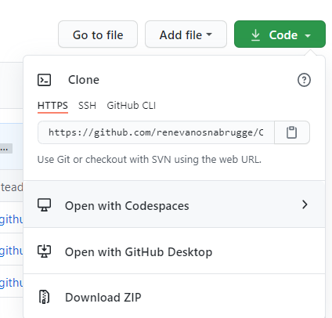
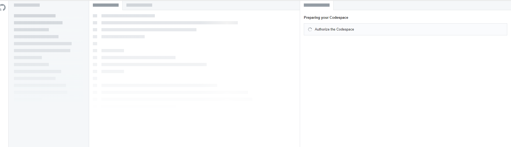

# Prerequisites for the Code To Cloud Workshop
This workshop is targeted for students in a instructor-led training. To make it challenging for the students, the workshop contains challenges that can also be done individually. To make sure students do not get stuck, there are scripts available with instructions to "automatically" fix a challenge, so students can continue. The workshop also contains extensive Step-By-Step videos and written instructions. There are also videos that explain the concepts that are used in the exercises.

## Code base
The workshop builds upon an existing code base. Before you start the workshop, this code base needs to be forked or cloned. 

1. Fork the [CodeToCloud-Source](https://github.com/xpiritbv/CodeToCloud-Source) Repo into your own account into a public repo.

## GitHub Codespace
The workshop is built with and targeted at development with GitHub Codespace. A full featured IDE in the cloud. In order to start working you need to create a Codespace.

1. Navigate to your forked repository on GitHub
2. Create a Code Space in your forked repo



3. Your GitHub Codespace will be created



## Set up workshop scripts
Furthermore, the workshop provides starter and solution scripts. These scripts are served as a Pull Request with instructions in your Git Repository. In order to make this work, and to make the scripts work we have set up a container and some helper scripts, that you can execute in the workshop.

To set this up, you need to perform these steps
* Create GitHub Personal Access Token
* Create Azure DevOps Personal Access Token
* Setup your settings file and PowerShell Profile

### Setup your settings file and PowerShell Profile
1. Open your GitHub Codespace 
1. In the terminal type `pwsh`
1. Then run `.workshop/setup.ps1`
    1. As part of the workflow you'll be asked to create a Personal Access Token for GitHub. For more information, see below.
    2. As part of the workflow you'll be asked to create a Personal Access Token for Azure DevOps. For more information, see below.
1. A local `settings.json` file has been created in the `.workshop` folder and is automatically ignored by git. **DO NOT COMMIT THIS TO YOUR REPO!**
1. This file is automatically loaded by the containers PowerShell Profile and pre-populates a number of global variables.

#### Create GitHub Personal Access Token
1. Login to your GitHub Account
1. Create a Personal Access Token as [described here](https://docs.github.com/en/free-pro-team@latest/github/authenticating-to-github/creating-a-personal-access-token)
1. Keep this Personal Access token somewhere safe for later use. **DO NOT COMMIT THIS TO YOUR REPO!**
[Permissions GH](Permissions-GH.png)

#### Create Azure DevOps Personal Access Token
1. Login to https://dev.azure.com/youraccount or create a new account on https://dev.azure.com
1. Create a Personal Access Token as [described here](https://docs.microsoft.com/en-us/azure/devops/organizations/accounts/use-personal-access-tokens-to-authenticate?view=azure-devops&tabs=preview-page)
1. Keep this Personal Access token somewhere safe for later use. **DO NOT COMMIT THIS TO YOUR REPO!**

## Run Start and Solution Scripts
When you go through the challenges or step by steps, you will see something like this

>This challenge needs some prerequisites. Run the following command in your Terminal windows of your GitHub >Codespace to set this up.
```
Workshop-Step Start "DEVWF-T00X"
```
When you see this, execute the following steps

* In your Codespace, open a `pwsh` terminal
* Run the command `Workshop-Step Start "DEVWF-T00X"`
* A Pull Request with scripts and instructions will be created for you.

## Variables
In some scripts we use variables like `$resourceGroupName` and `$webappName`. Based on the settings.json file, that is stored in your `.workshop` folder, we generated a PowerShell Profile for you. The values stored in `settings.json` are automatically loaded into your powershell console.

Available variables (loaded into `$global:` and `$env` scopes):

```powershell
$studentsuffix         # short lowercase string of letters unique to you.
$resourcegroupName     # the name of the resource group that will be created for you
$cosmosDBName          # the name of the cosmosdb used by the webapp
$webappName            # web app service name
$planName              # web app service plan
$location1             # azure datacenter region
$location2             # azure datacenter region
$appInsights           # app insights instance name
$CR_PAT                # GitHub container registry accerr token
```

### Next Step
When you are done, move to the [first challenge](/Challenges/Module0-Introduction/Introduction.md)
