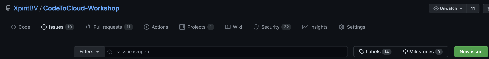
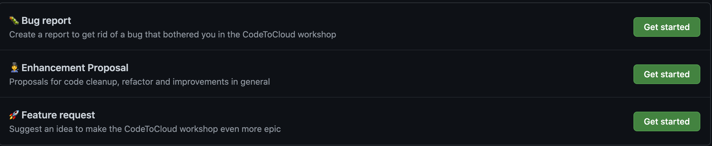

# CodeToCloud with GitHub and Azure DevOps Workshop - Student Materials

This repository contains the student materials for the Code To Cloud workshop. This workshop focuses on the Code to Cloud journey. The journey includes the integration with Azure Boards, working with GitHub Codespaces, the GitHub Flow, and the GitHub Container Registry. You will learn to use docker and docker-compose and deploy their solution to an Azure Web App using GitHub Actions, and Azure DevOps pipelines.

To make it challenging, the workshop contains challenges that can also be done individually. To make sure you do not get stuck, there are scripts available with instructions to "automatically" fix a challenge, so you can continue your learning. The workshop also contains extensive Step-By-Step videos and written instructions. There are also videos that explain the concepts that are used in the exercises.

This workshop focuses on the Code to Cloud journey. When you want to dive in to Cloud Native and the setup and configuration of Kubernetes, you can continue your learning journey with the [Cloud Native Workshop Workshop of Microsoft](https://github.com/microsoft/Cloud-Native-In-a-Day), which build upon the same sources. 

## Agenda

 - [Module 0 - Introduction](/Challenges/Module0-Introduction/Introduction.md)
   - Introduction by Instructor
   - Introduction of Students
   - Design Cloud Architecture and DevOps Roadmap for Fabrikam Medical Conferences
   - Presentations

 - [Setup Prerequisites](/Challenges/Prerequisites/Readme.md)
 > These prerequisites have to be performed before starting the modules! This will take approximately 30 minutes.

 - [Module 1 - Improving the Developer Workflow](/Challenges/Module1-ImprovingDeveloperFlow/ImprovingDeveloperWorkflow.md)
   - Instruction by Instructor
   - Challenge
   - Presentation & Discussion

 - Lunch break

 - [Module 2 - Moving to the Cloud](/Challenges/Module2-MovingToTheCloud/MovingToTheCloud.md)
   - Instruction by Instructor
   - Challenge
   - Presentation & Discussion

 - [Module 3 - Closing the Feedback Loop](/Challenges/Module3-ClosingTheFeedbackLoop/ClosingTheFeedbackloop.md)
   - Instruction by Instructor
   - Challenge
   - Presentation & Discussion
 - Closing

## Challenges & Sources
All challenges can be found in the [Challenges](/Challenges/README.md) folder. This repository is supported by a Git Repository that contains all sources. This can be found [here](https://github.com/XpiritBV/CodeToCloud-Source). 

To get started with the workshop, please go ahead to the [Set up Prerequisites](/Challenges/Prerequisites/Readme.md) page.

When you have set up your prerequisites you can start with the modules.

### Module 0 - Introduction
- [Instructions](Challenges/Module0-Introduction/Introduction.md)
- [Outline of the Day](/TrainerMaterials/Presentations/OutlineOfTheDay.pptx)

### Prerequisites
- [Instructions](Challenges/Prerequisites/Readme.md)
> These prerequisites have to be performed before starting the modules! This will take approximately 30 minutes.
### Module 1 - Improving the Developer Workflow
- [Instructions](Challenges/Module1-ImprovingDeveloperFlow/ImprovingDeveloperWorkflow.md)
- [Step by Step Instructions](Challenges/Module1-ImprovingDeveloperFlow/Step-By-Step/Readme.md)

### Module 2 - Moving to the Cloud
- [Instructions](Challenges/Module2-MovingToTheCloud/MovingToTheCloud.md)
- [Step by Step Instructions](Challenges/Module2-MovingToTheCloud/Step-By-Step/Readme.md)

### Module 3 - Closing the Feedback Loop
- [Instructions](Challenges/Module3-ClosingTheFeedbackLoop/ClosingTheFeedbackloop.md)
- [Step by Step Instructions](Challenges/Module3-ClosingTheFeedbackLoop/Step-By-Step/Readme.md)

## We'd appreciate your feedback!
In case you find any issues, make sure to provide feedback on the Workshop in the CodeToCloud Workshop repository: https://github.com/XpiritBV/CodeToCloud-Workshop. This way the developers get a good idea of issues that were encountered by students, and the workshop will be improved further. You can also come up with enhancement proposals that you think would bring the workshop to a higher level!

Issues and pull requests have been disabled for this repo. These can be added to the [parent repository](https://github.com/XpiritBV/CodeToCloud-Workshop) and will be reflected in this repo! 